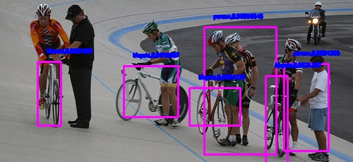
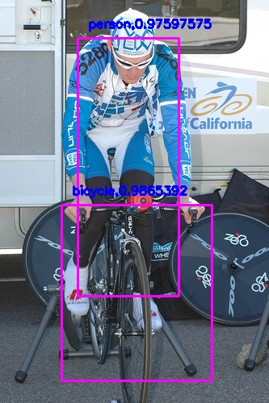

## YOLO-v2

------

## Introduction

Here is my experimental code implementation of the model described in the paper [YOLO9000: Better, Faster, Stronger](https://arxiv.org/abs/1612.08242) by pytorch.

The purpose of this code is to understand the entire implementation process of yolo-v2 step by step, especially how yolo-layer works. Therefore, the code is not very elegant.

## train

voc data format

    imgs
        1.jpg
        2.jpg
    xmls
        1.xml
        2.xml

* Set the target categories to be detected in tools/gen_anchor.py and train.py, respectively
* Specify the number of anchors and file paths in tools/gen_anchor.py, and run this python file to get anchors
* Copy the anchors to parser.--anchors in train.py, and specify file path and other parameters. Then python train.py

## detection

* Set the target categories to be detected in detect.py
* Copy the anchors to parser.--anchors in detect.py, and specify test image/images path, then python detect.py

## test result

### VOC

### personal dataset

## Since there are no pre-training weights and large data sets, progressive training is an effective technique. First, overfitting on a small part of the training set and then gradually generalizing. 
